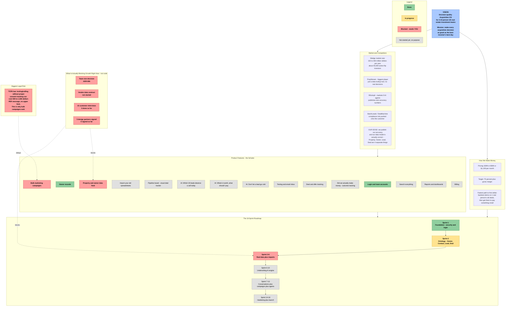

# VISION_MAP — The whole company, on one page

**For you — the CEO — to look at any time and instantly remember: what this is, where we
stand, and what's blocking growth.** Green = done. Yellow = in progress. Red = blocked on
you, not on code. Grey = not started yet, on purpose.

**How to view this:** if you're reading this on GitHub.com, the picture below renders
automatically. If you're reading it in a plain text editor, paste the code block (everything
between the ` ```mermaid ` lines) into **mermaid.live** to see it as a picture instead of
text.

_Last updated: 2026-07-19_



## The one-paragraph version, in case the picture doesn't load

You're building software that tells small real-estate investment teams what to buy, what to
pay, and who to call — and proves its numbers are right, which nobody else in this space
does. Foundation (login, security, first piece of the data model) is built and tested. The
entire rest of the product is not built yet, on purpose, because it's sequenced behind three
things only you can do: decide your team size, sign a data contract, and talk to 15 real
investors. Once those move, engineering has a long but clear 18-sprint runway to follow.
